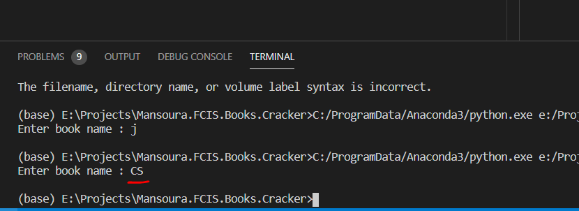

# Mansoura.FCIS.Books.Cracker
This app can be used to create a PDF book from the EXE edition

ُ## 2 Methods of Extraction
    - Reverse Enginerring
        - All my tries failed to find the PDF in the Exe Binaries but in Shaa ALLAH, I will
    - Image Processing => Currently work but need improves

## First install prerequested packages below:

```
pip install opencv-python
pip install Pillow
pip insatll numpy
pip install pyautogui
pip install python3_xlib python-xlib
```

- Choose the Book name and the Num of Book Pages
- it waits 5 seconds to begin the capturing you can just open the exe book in the mode in follwing figure then the capturing automatically run 

- wait until it finish then the book is extracted as PDF


## Congrats this is your pdf


@CopyRight Ahmed Khalil 2019/2020